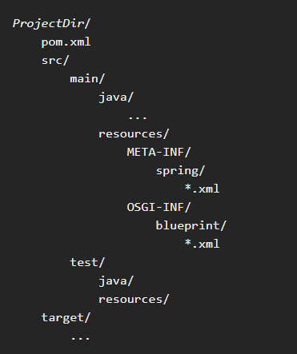

# Building project generic for fuse camel karaf

*build estructura del projecto generico*



*add pom.xml template*

[pom.xml](https://gist.github.com/sparsick/aec73d514b1ef248d92d)

*add bom apache camel*

[BOM camel](https://camel.apache.org/releases/release-3.9.0/)

*add dependency fuse karaf bom and repository*

[BOM Fuse karaf](https://access.redhat.com/documentation/en-us/red_hat_fuse/7.5/html-single/getting_started/index#add-red-hat-repositories-to-maven)

[Repository easyall](https://access.redhat.com/documentation/en-us/red_hat_fuse/7.5/html-single/migration_guide/index#upgrading-fuse-applications-on-karaf-standalone)

*add log4j.properties*

[log4j.properties](https://github.com/mondora/sample-project/blob/master/src/main/resources/log4j.properties)

---

*settings.xml or into pom.xml from <repositories/>* 
```xml
<?xml version="1.0"?>
<settings>

  <profiles>
    <profile>
      <id>extra-repos</id>
      <activation>
        <activeByDefault>true</activeByDefault>
      </activation>
      <repositories>
       <repository>
            <id>redhat-ga-repository</id>
            <url>https://maven.repository.redhat.com/ga</url>
            <releases>
                <enabled>true</enabled>
            </releases>
            <snapshots>
                <enabled>false</enabled>
            </snapshots>
        </repository>
        <repository>
            <id>redhat-ea-repository</id>
            <url>https://maven.repository.redhat.com/earlyaccess/all</url>
            <releases>
                <enabled>true</enabled>
            </releases>
            <snapshots>
                <enabled>false</enabled>
            </snapshots>
        </repository>
        <repository>
          <id>jboss-public</id>
          <name>JBoss Public Repository Group</name>
          <url>https://repository.jboss.org/nexus/content/groups/public/</url>
        </repository>
      </repositories>
      <pluginRepositories>
        <pluginRepository>
            <id>redhat-ga-repository</id>
            <url>https://maven.repository.redhat.com/ga</url>
            <releases>
                <enabled>true</enabled>
            </releases>
            <snapshots>
                <enabled>false</enabled>
            </snapshots>
        </pluginRepository>
        <pluginRepository>
            <id>redhat-ea-repository</id>
            <url>https://maven.repository.redhat.com/earlyaccess/all</url>
            <releases>
                <enabled>true</enabled>
            </releases>
            <snapshots>
                <enabled>false</enabled>
            </snapshots>
        </pluginRepository>
        <pluginRepository>
          <id>jboss-public</id>
          <name>JBoss Public Repository Group</name>
          <url>https://repository.jboss.org/nexus/content/groups/public</url>
        </pluginRepository>
      </pluginRepositories>
    </profile>
  </profiles>

  <activeProfiles>
    <activeProfile>extra-repos</activeProfile>
  </activeProfiles>

</settings>
```
---
*pom.xml*
```xml
 <properties>
    <project.build.sourceEncoding>UTF-8</project.build.sourceEncoding>
    <fuse.version>7.5.0.fuse-750029-redhat-00002</fuse.version>
    <camel.version>3.9.0</camel.version>
  </properties>

<dependencyManagement>
    <dependencies>
      <dependency>
        <groupId>org.jboss.redhat-fuse</groupId>
        <artifactId>fuse-karaf-bom</artifactId>
        <version>${fuse.version}</version>
        <type>pom</type>
        <scope>import</scope>
      </dependency>
      <dependency>
          <groupId>org.apache.camel</groupId>
          <artifactId>camel-bom</artifactId>
          <version>${camel.version}</version>
          <type>pom</type>
      </dependency>
    </dependencies>
  </dependencyManagement>

<!--dependency minimal for working -->
  	<dependency>
			<groupId>org.apache.camel</groupId>
			<artifactId>camel-core</artifactId>
		</dependency>
		<dependency>
			<groupId>org.slf4j</groupId>
			<artifactId>slf4j-api</artifactId>
		</dependency>
		<dependency>
			<groupId>org.slf4j</groupId>
			<artifactId>slf4j-simple</artifactId>
		</dependency>
		<dependency>
			<groupId>javax.xml.bind</groupId>
			<artifactId>jaxb-api</artifactId>
			<version>2.4.0-b180830.0359</version>
		</dependency>
```
---
*log4j.properties*
```properties
log4j.rootLogger=INFO, out
#log4j.logger.org.apache.camel=INFO
log4j.appender.out=org.apache.log4j.ConsoleAppender
log4j.appender.out.layout=org.apache.log4j.PatternLayout
log4j.appender.out.layout.ConversionPattern=[%30.30t] %-30.30c{1} %-5p %m%n
```

---
*TestExample.java*
```java
public class TestExample {

	public static void main(String[] args) throws Exception {
		CamelContext context = new DefaultCamelContext();
		context.start();
		context.addRoutes(new RouteBuilder() {
			@Override
			public void configure() throws Exception {
				from("timer:foo?period=5s")
				.log("HOLA MUNDO")
				.to("mock:out");
			}
		});
		TimeUnit.SECONDS.sleep(15);
		context.stop();
	}
}
```


## Documentos Importantes

**Fuse Standalone Getting Started**
- [Installing on Apache Karaf](https://access.redhat.com/documentation/en-us/red_hat_fuse/7.0/html-single/installing_on_apache_karaf/index)

**Fuse Standalone Administration**
- [Deploying into Apache Karaf](https://access.redhat.com/documentation/en-us/red_hat_fuse/7.0/html-single/deploying_into_apache_karaf/index)

**Development**
- [Apache Camel Development Guide](https://access.redhat.com/documentation/en-us/red_hat_fuse/7.0/html-single/apache_camel_development_guide/index)

- [Apache CXF Development Guide](https://access.redhat.com/documentation/en-us/red_hat_fuse/7.0/html-single/apache_cxf_development_guide/index)

**Reference**
- [Apache Karaf Console Reference](https://access.redhat.com/documentation/en-us/red_hat_fuse/7.0/html-single/apache_karaf_console_reference/index)


## Download Red Hat Fuse 7.0 and Configuration

[Red Hat Fuse 7 Is Now Available](https://developers.redhat.com/blog/2018/06/04/red-hat-fuse-7-is-now-available/)

[Product Documentation for Red Hat Fuse 7.0](https://access.redhat.com/documentation/en-us/red_hat_fuse/7.0/)

[Download](https://developers.redhat.com/products/fuse/download)

