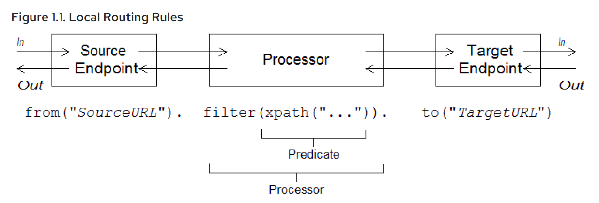

# **PART I. IMPLEMENTING ENTERPRISE INTEGRATION PATTERNS**

## **CHAPTER 1. BUILDING BLOCKS FOR ROUTE DEFINITIONS**

### **Abstract**

Apache Camel supports two alternative Domain Specific Languages (DSL) for defining routes: a Java
DSL and a Spring XML DSL

- Java DSL
```java
from("file:data/inbox").to("jms:queue:order");`
```
- XML DSL
```xml
<route>
        <from uri="file:data/inbox"/>
        <to uri="jms:queue:order"/>
</route>
```

### **1.1. IMPLEMENTING A ROUTEBUILDER CLASS**

-  **RouteBuilder classes**
      - **org.apache.camel.builder.RouteBuilder** — this is the generic RouteBuilder base class that is suitable for deploying into any container type. It is provided in the **camel-core** artifact.
      - **org.apache.camel.spring.SpringRouteBuilder** — this base class is specially adapted to the Spring container. In particular, it provides extra support for the following Spring specific features: looking up beans in the Spring registry (using the beanRef() Java DSL command) and transactions (see the Transactions Guide for details. It is provided in the **camel-spring** artifact.


```java
import org.apache.camel.builder.RouteBuilder;

public class MyRouteBuilder extends RouteBuilder {
        public void configure() {
                // Define routing rules here:
                from("file:src/data?noop=true")
                .to("file:target/messages");

                // More rules can be included, in you like.
                // ...
        }
}
```

### **1.2. BASIC JAVA DSL SYNTAX**

#### **What is a DSL?**
A Domain Specific Language (DSL) is a mini-language designed for a special purpose. A DSL does not
have to be logically complete but needs enough expressive power to describe problems adequately in
the chosen domain. Typically, a DSL does not require a dedicated parser, interpreter, or compiler. A DSL
can piggyback on top of an existing object-oriented host language, provided DSL constructs map
cleanly to constructs in the host language API.

#### **Router rule syntax**



#### **Consumers and producers**

A local rule always starts by defining a consumer endpoint, using **from("EndpointURL")**, and typically (but not always) ends by defining a producer endpoint, using **to("EndpointURL")**.

#### **Exchanges**

An exchange object consists of a message, augmented by metadata. Exchanges are of central importance in Apache Camel, because the exchange is the standard form in which messages are propagated through routing rules.
The main constituents of an exchange are, as follows:

- **In** message — is the current message encapsulated by the exchange. The org.apache.camel.Message type provides a generic model of a message, with the following parts:
     - Body.
     - Headers.
     - Attachments.

     The original content of the body and the headers is then determined by the endpoint that created the exchange instance (that is, the endpoint appearing in the **from()** command).

- **Out** message — is a temporary holding area for a reply message or for a transformed message. Certain processing nodes (in particular, the **to()** command) can modify the current message by treating the In message as a request, sending it to a producer endpoint, and then receiving a reply from that endpoint. The reply message is then inserted into the Out message slot in the exchange.

- Message exchange pattern (MEP) — affects the interaction between the exchange and endpoints in the route, as follows:
     * **Consumer endpoint** — the consumer endpoint that creates the original exchange sets the initial value of the MEP. The initial value indicates whether the consumer endpoint expects to receive a reply (for example, the InOut MEP) or not (for example, the InOnly MEP).
     * **Producer endpoints** — the MEP affects the producer endpoints that the exchange encounters along the route (for example, when an exchange passes through a to() node).

- Exchange properties — a list of named properties containing metadata for the current message.

#### *Message exchange patterns**

Using an Exchange object makes it easy to generalize message processing to different message
exchange patterns.

Apache Camel supports the following MEPs:
* InOnly
* RobustInOnly
* InOut
* InOptionalOut
* OutOnly
* RobustOutOnly
* OutIn
* OutOptionalIn

Where these message exchange patterns are represented by constants in the enumeration type,**org.apache.camel.ExchangePattern.**

#### Grouped exchanges

A grouped exchange is essentially an exchange instance that contains a **java.util.List** of **Exchange** objects stored in the **Exchange.ROUPED_EXCHANGE** exchange property.

