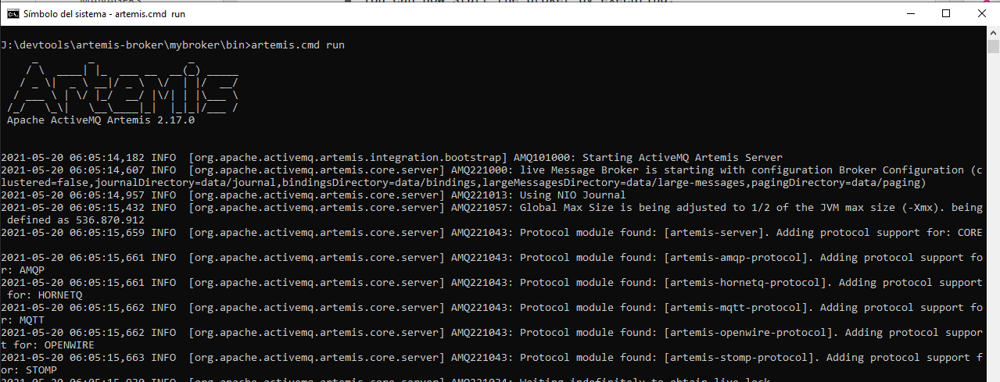
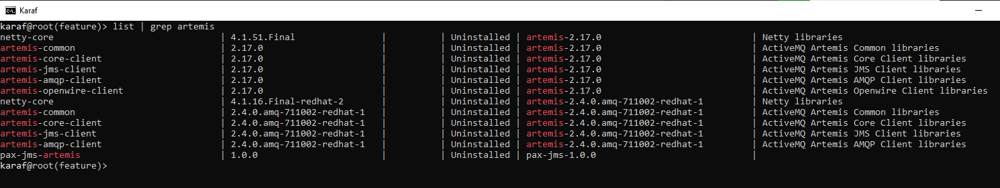
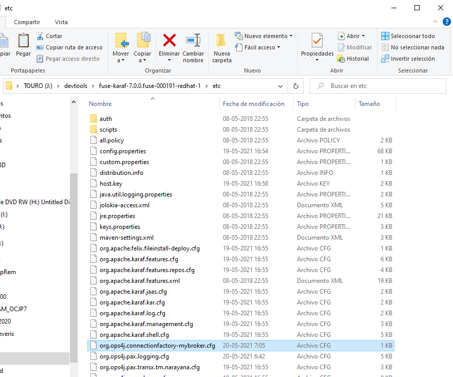
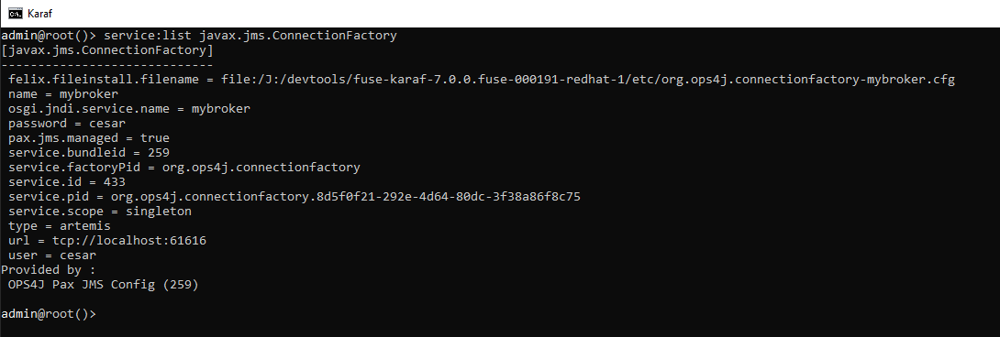
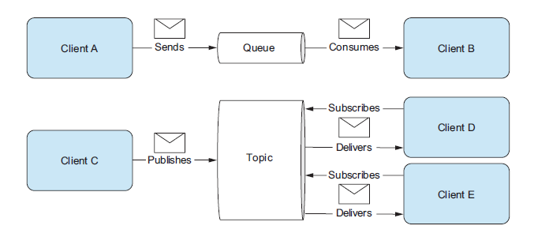

# Use Camel components

## Transaction

To ensure that an operation like this is reliable, implement it as a transaction. A transaction guarantees reliable execution because it is atomic, consistent, isolated, and durable. These properties are referred to as a transaction’s ACID properties.

The ACID properties of a transaction are defined as follows:
- **Atomic**—a transaction is an all or nothing procedure. Individual updates are assembled and
either committed or aborted (rolled back) simultaneously when the transaction completes.
- **Consistent**—a transaction is a unit of work that takes a system from one consistent state to
another consistent state.
- **Isolated**—while a transaction is executing, its partial results are hidden from other entities.
- **Durable**—the results of a transaction are persistent even if the system fails immediately after a transaction has been committed.

## About Transaction Clients

A transaction client is an API or object that enables you to initiate and end transactions. Typically, a transaction client exposes operations that **begin, commit, or roll back** a transaction.
In a standard JavaEE application, the **javax.transaction.UserTransaction** interface exposes
the transaction client API. 
In the context of the Spring Framework, Spring Boot, the **org.springframework.transaction.PlatformTransactionManager** interface exposes a transaction client API.

## Use Camel components JMS
* Pre-Requisites - Install broker Artemis ActiveMQ 2.17.0
```bash
mkdir artemis-brokers
cd artemis-brokers
$ARTEMIS_HOME/bin/artemis create --user cesar --admin cesar --require-login mybroker
$artemis-brokers/bin/artemis run
```


- Client libraries are required: Maven Central o Red Hat repository 
```xml
<!-- https://mvnrepository.com/artifact/org.apache.activemq/artemis-core-client -->
<dependency>
    <groupId>org.apache.activemq</groupId>
    <artifactId>artemis-core-client</artifactId>
    <version>2.17.0</version>
</dependency>

<!-- https://mvnrepository.com/artifact/org.apache.activemq/artemis-jms-client -->
<dependency>
    <groupId>org.apache.activemq</groupId>
    <artifactId>artemis-jms-client</artifactId>
    <version>2.17.0</version>
</dependency>
``` 
- Client libraries can be installed as Karaf features:
```bash
karaf@root()> feature:repo-add mvn:org.apache.activemq/artemis-features/2.17.0/xml/features
```


- Alternatively, Artemis/AMQ 7 client libraries can be installed as Karaf features, for example:
```bash
karaf@root()> feature:install artemis-jms-client artemis-core-client
```


- Some supporting features that provide Karaf shell commands or dedicated Artemis support are required:
```bash
karaf@root()> feature:install jms pax-jms-artemis pax-jms-config
```
- Required Camel features are:
```bash
karaf@root()> feature:install camel-jms camel-blueprint
```
 - Create a file configuration
 *org.ops4j.connectionfactory-mybroker.cfg* 
```properties
url      = tcp://localhost:61616
name     = mybroker
type     = artemis
user     = cesar
password = cesar
```
- Copy a file configuration to $FUSE_HOME/etc


- Verify the published connection factory:
```bash
karaf@root()> service:list javax.jms.ConnectionFactory
```


- download the project camel-jms 
 
[Project camel-jms](https://github.com/genesiscastillo/ccastillo-camel-jms)
- change in pom.xml add directory of fuse_home
```xml
	<properties>
		<my.fuse.dir.home>j:/devtools/fuse-karaf-7.0.0.fuse-000191-redhat-1</my.fuse.dir.home>
	</properties>
```
- execute install maven
```bash
mvn clean install
```
* Sending to a JMS endpoint



> There are two types of JMS destinations: queues and topics. The queue is a point-to-point channel; each message has only one recipient. A topic delivers a copy of the message to all clients that have subscribed to receive it.


* How to configure Camel to use a JMS provider

```java
//ConnectionFactory connectionFactory = new ActiveMQConnectionFactory("vm://localhost");
ConnectionFactory connectionFactory = new ActiveMQConnectionFactory("tcp://localhost:61616");

CamelContext context = new DefaultCamelContext();
context.addComponent("jms",JmsComponent.jmsComponentAutoAcknowledge(connectionFactory));
```
* dependency jms and connectionFactory ActiveMQ
```xml
<dependency>
    <groupId>org.apache.camel</groupId>
    <artifactId>camel-jms</artifactId>
    <version>2.20.1</version>
</dependency>

<dependency>
<groupId>org.apache.activemq</groupId>
<artifactId>activemq-all</artifactId>
<version>5.15.2</version>
</dependency>
```

```java
    ConnectionFactory connectionFactory = new ActiveMQConnectionFactory("tcp://localhost:61616");
    CamelContext camelContext = new DefaultCamelContext();
    camelContext.addComponent("jms", JmsComponent.jmsComponent(connectionFactory));
    camelContext.addRoutes(new RouteBuilder() {
        @Override
        public void configure() throws Exception {
            from("timer://foo?period=1s")
            .setBody()
            .constant("CESAR CASTILLO")
            .log("hola ${body}")
            .setBody().constant("Enviando mensaje :${date:now:yyyyMMdd-hh:mm:ss} - ${body}")
            .to("jms:queue:incomingOrders")
            .to("mock:out");
            
            from("jms:queue:incomingOrders")
            .log("mensaje : ${body}")
            .to("mock:out");
        }
    });

```

