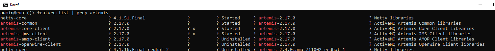

# Use Camel components

## Transaction

To ensure that an operation like this is reliable, implement it as a transaction. A transaction guarantees reliable execution because it is atomic, consistent, isolated, and durable. These properties are referred to as a transaction’s ACID properties.

The ACID properties of a transaction are defined as follows:
- **Atomic**—a transaction is an all or nothing procedure. Individual updates are assembled and
either committed or aborted (rolled back) simultaneously when the transaction completes.
- **Consistent**—a transaction is a unit of work that takes a system from one consistent state to
another consistent state.
- **Isolated**—while a transaction is executing, its partial results are hidden from other entities.
- **Durable**—the results of a transaction are persistent even if the system fails immediately after a transaction has been committed.

## About Transaction Clients

A transaction client is an API or object that enables you to initiate and end transactions. Typically, a transaction client exposes operations that **begin, commit, or roll back** a transaction.
In a standard JavaEE application, the **javax.transaction.UserTransaction** interface exposes
the transaction client API. 
In the context of the Spring Framework, Spring Boot, the **org.springframework.transaction.PlatformTransactionManager** interface exposes a transaction client API.

## Use Camel components JMS
### Pre-Requisites - Install RedHat Fuse 7.0.0

[Donwload RedHat Fuse 7.0.0](https://developers.redhat.com/products/fuse/download)

-  open two console and execute in $FUSE_HOME/bin:
    * fuse.bat
    * client.bat


### in console FUSE , execute :
```bash
karaf@root()> log:tail
```     


### Pre-Requisites - Install broker Artemis ActiveMQ 2.17.0

[Donwload Artemis](https://activemq.apache.org/components/artemis/)

    * create new dir ´artemis-brokers´ and execute follow:
```bash
> mkdir artemis-brokers
> cd artemis-brokers
>$ARTEMIS_HOME/bin/artemis create --user cesar --admin cesar --require-login mybroker
> artemis-brokers/bin/artemis run
```


- Client libraries are required: Maven Central o Red Hat repository (ONLY IS A INFORMATION FOR DEVELOPMENT)
```xml
<!-- https://mvnrepository.com/artifact/org.apache.activemq/artemis-core-client -->
<dependency>
    <groupId>org.apache.activemq</groupId>
    <artifactId>artemis-core-client</artifactId>
    <version>2.17.0</version>
</dependency>

<!-- https://mvnrepository.com/artifact/org.apache.activemq/artemis-jms-client -->
<dependency>
    <groupId>org.apache.activemq</groupId>
    <artifactId>artemis-jms-client</artifactId>
    <version>2.17.0</version>
</dependency>
``` 
### In console client execute the follows:

- Client libraries can be installed as Karaf features:
```bash
karaf@root()> feature:repo-add mvn:org.apache.activemq/artemis-features/2.17.0/xml/features
```


- Alternatively, Artemis/AMQ 7 client libraries can be installed as Karaf features, for example:
```bash
karaf@root()> feature:install artemis-jms-client artemis-core-client
```


- Some supporting features that provide Karaf shell commands or dedicated Artemis support are required:
```bash
karaf@root()> feature:install jms pax-jms-artemis pax-jms-config
```
- Required Camel features are:
```bash
karaf@root()> feature:install camel-jms camel-blueprint
```
 - Create a file configuration
 *org.ops4j.connectionfactory-mybroker.cfg* 
```properties
url      = tcp://localhost:61616
name     = mybroker
type     = artemis
user     = cesar
password = cesar
```
- Copy a file configuration to $FUSE_HOME/etc


- Verify the published connection factory:
```bash
karaf@root()> service:list javax.jms.ConnectionFactory
```


- download the project camel-jms 
 
[Project camel-jms](https://github.com/genesiscastillo/ccastillo-camel-jms)
- change in pom.xml add directory of fuse_home
```xml
	<properties>
		<my.fuse.dir.home>j:/devtools/fuse-karaf-7.0.0.fuse-000191-redhat-1</my.fuse.dir.home>
	</properties>
```
### deploy to fuse (two options)
- first option : execute install maven
```bash
mvn clean install
```
- second options: 
    - execute package maven
```bash
mvn clean package
```
    - install with karaf
```bash
karaf@root()> install -s  mvn:org.jboss.fuse.quickstarts/camel-jms/7.0.0.fuse-000191-redhat-1
```

* Confirm that it is working:
```bash
karaf@root()> camel:context-list
```

*  execute testing
copy dir $PROJECT/work to $FUSE_HOME/


* check camel route statitics:
```bash
karaf@root()> camel:route-info jms-example-context file-to-jms-route
```


* revision de clases transaction 
```bash
karaf@root()> service:list
org.springframework.transaction.PlatformTransactionManager

karaf@root()> headers 21

karaf@root()> bundle:services -p 21
```

The transaction manager is available from these interfaces:

- **javax.transaction.TransactionManager**
- **javax.transaction.TransactionSynchronizationRegistry**
- **javax.transaction.UserTransaction**
- **org.jboss.narayana.osgi.jta.ObjStoreBrowserService**
- **org.ops4j.pax.transx.tm.TransactionManager**
- **org.springframework.transaction.PlatformTransactionManager**

You can use any of them in any context that you need. For example camel-jms requires that the **org.apache.camel.component.jms.JmsConfiguration.transactionManager** field be
initialized. This is why the example uses:

```xml
<reference id="transactionManager"
interface="org.springframework.transaction.PlatformTransactionManager" />
```
instead of, for example:
```xml
<reference id="transactionManager"
interface="javax.transaction.TransactionManager" />
```
### About local transaction managers

It is possible for an application to have many different local transaction managers working independently
of each other. For example, you could have one Camel route that manipulates JMS queues and topics,
where the JMS endpoints reference a JMS transaction manager. Another route could access a relational
database through JDBC. But you could not combine JDBC and JMS access in the same route and have
them both participate in the same transaction.

### About Global transaction managers

A global transaction manager is a transaction manager that can coordinate transactions over multiple
resources. This is required when you cannot rely on the transaction manager built into the resource itself.
An external system, sometimes called a transaction processing monitor (TP monitor), is capable of
coordinating transactions across different resources

### About distributed transaction managers

Usually, a server connects directly to the resources involved in a transaction. In a distributed system,
however, it is occasionally necessary to connect to resources that are exposed only indirectly, through a
Web service. In this case, you require a TP monitor that is capable of supporting distributed transactions.
Several standards are available that describe how to support transactions for various distributed
protocols, for example, the WS-AtomicTransactions specification for Web services.

## USING A JAVAEE TRANSACTION CLIENT

to interact with a transaction manager
is the Java Transaction API (JTA) interface, **javax.transaction.UserTransaction**

```java
InitialContext context = new InitialContext();
UserTransaction ut = (UserTransaction)
context.lookup("java:comp/UserTransaction");
ut.begin();
// Access transactional, JTA-aware resources such as database and/or
message broker
ut.commit(); // or ut.rollback()
```

## USING A SPRING BOOT TRANSACTION CLIENT

One of the main goals of the Spring Framework (and Spring Boot) is to make JavaEE APIs easier to use.
All major JavaEE vanilla APIs have their part in the Spring Framework (Spring Boot). These are not
alternatives or replacements of given APIs, but rather wrappers that add more configuration options or
more consistent usage, for example, with respect to exception handling

JavaEE API | Spring Utility | Configured With
---|---|---
JDBC | org.springframework.jdbc.core.JdbcTemplate | javax.sql.DataSource
JMS | org.springframework.jms.core.JmsTemplate | javax.jms.ConnectionFactory
JTA | org.springframework.transaction.support.TransactionTemplate | org.springframework.transaction.PlatformTransactionManager

---

## CONFIGURING THE NARAYANA TRANSACTION MANAGER

In Fuse, the built-in, global transaction manager is **JBoss Narayana Transaction Manager**, which is the same transaction manager that is used by Enterprise Application Platform (EAP) 7.
In the OSGi runtime, as in Fuse for Karaf, the additional integration layer is provided by the **PAX TRANSX** project.

### ABOUT NARAYANA INSTALLATION
The Narayana transaction manager is exposed for use in OSGi bundles under the following interfaces,as well as a few additional support interfaces:
- javax.transaction.TransactionManager
- javax.transaction.UserTransaction
- org.springframework.transaction.PlatformTransactionManager
- org.ops4j.pax.transx.tm.TransactionManager

The fuse-karaf-7.0.0.fuse-000191-redhat-1 distribution makes these interfaces available from the start.
The pax-transx-tm-narayana feature contains an overridden bundle that embeds Narayana:

## USING THE OSGI JDBC SERVICE

Chapter 125 of the OSGi Enterprise R6 specification defines a single interface in the **org.osgi.service.jdbc** package. This is how OSGi handles data sources:

```java
public interface DataSourceFactory {
    java.sql.Driver createDriver(Properties props);
    javax.sql.DataSource createDataSource(Properties props);
    javax.sql.ConnectionPoolDataSource createConnectionPoolDataSource(Properties props);
    javax.sql.XADataSource createXADataSource(Properties props);
}
```

### Generic org.osgi.service.jdbc.DataSourceFactory

```bash
karaf@root()> install -s mvn:org.osgi/org.osgi.service.jdbc/1.0.0

karaf@root()> install -s mvn:org.ops4j.pax.jdbc/pax-jdbc/1.3.0

karaf@root()> install -s mvn:mysql/mysql-connector-java/5.1.46

karaf@root()> bundle:services -p com.mysql.jdbc

karaf@root()> service:list org.osgi.service.jdbc.DataSourceFactory
```


With the above commands, the **javax.sql.DataSource** service is still not registered, but you are one step closer. The above intermediary **org.osgi.service.jdbc.DataSourceFactory** services can be used to obtain:
- **java.sql.Driver**
- **javax.sql.DataSource** by passing properties: **url, user and password** to the createDataSource() method.

You cannot obtain **javax.sql.ConnectionPoolDataSource** or **javax.sql.XADataSource** from the generic **org.osgi.service.jdbc.DataSourceFactory** created by a non database-specific **pax-jdbc** bundle.

### Dedicated, database-specific org.osgi.service.jdbc.DataSourceFactory implementations 
There are additional bundles such as the following:
mvn:org.ops4j.pax.jdbc/pax-jdbc-mysql/1.3.0

```bash

karaf@root()> feature:repo-add mvn:org.ops4j.pax.jdbc/pax-jdbc-features/1.3.0/xml/features-gpl

karaf@root()> features:install pax-jdbc-mysql

karaf@root()> bundle:services -p org.ops4j.pax.jdbc.mysql
```
## PAX-JDBC configuration service

Install the **pax-jdbc** bundle and the **pax-jdbc-config** bundle that tracks **org.osgi.service.jdbc.DataSourceFactory** services and **org.ops4j.datasource** factory PIDs:

```bash
karaf@root()> install -s mvn:org.ops4j.pax.jdbc/pax-jdbc-pool-common/1.3.0

karaf@root()> install -s mvn:org.ops4j.pax.jdbc/pax-jdbc-config/1.3.0

karaf@root()> bundle:services -p org.ops4j.pax.jdbc.config
```


Create the factory configuration **(assume a MySQL server is running)**:
```bash
karaf@root()> config:edit --factory --alias mysql org.ops4j.datasource
karaf@root()> config:property-set osgi.jdbc.driver.name mysql
karaf@root()> config:property-set dataSourceName mysqlds
karaf@root()> config:property-set url jdbc:mysql://localhost:3306/reportdb
karaf@root()> config:property-set user fuse
karaf@root()> config:property-set password fuse
karaf@root()> config:update
karaf@root()> config:list '(service.factoryPid=org.ops4j.datasource)'
```


Check if pax-jdbc-config processed the configuration into the javax.sql.DataSource service:
```bash
karaf@root()> service:list javax.sql.DataSource
```


### Working with jdbc from fuse karaf

```bash
karaf@root()> feature:list | grep jdbc
```


```bash
karaf@root()> feature:install -v jdbc
```


```bash
karaf@root()> jdbc:ds-list
```


```bash
karaf@root()> jdbc:query mysqlds 'select * from pet'
```


### using jdbc console commands

```bash
karaf@root()> jdbc:ds-factories
karaf@root()> la -l | grep mysql
```


### install datasource from blueprint xml file

```bash
karaf@root()> bundle:install -s blueprint:file:quickstarts/blueprints/pax-jdbc-mysql-mydb.xml
Bundle ID: 282
karaf@root()> bundle:services -p 282
```
*pax-jdbc-mysql-mydb.xml*
```xml
<blueprint xmlns:xsi="http://www.w3.org/2001/XMLSchema-instance" xmlns="http://www.osgi.org/xmlns/blueprint/v1.0.0">
    <bean class="com.mysql.jdbc.jdbc2.optional.MysqlDataSource" id="mysqlDatasource">
        <property name="serverName" value="localhost"></property>
        <property name="databaseName" value="mydb"></property>
        <property name="port" value="3306"></property>
        <property name="user" value="cesar"></property>
        <property name="password" value="cesar"></property>
   </bean>

    <service id="mysqldsfile" interface="javax.sql.DataSource" ref="mysqlDatasource">
        <service-properties>
            <entry key="osgi.jndi.service.name" value="jdbc/mydbfile"/>
        </service-properties>
    </service>
</blueprint>
```

---
## Prueba de Conceptos: Sending to a JMS endpoint


> There are two types of JMS destinations: queues and topics. The queue is a point-to-point channel; each message has only one recipient. A topic delivers a copy of the message to all clients that have subscribed to receive it.


* How to configure Camel to use a JMS provider

```java
//ConnectionFactory connectionFactory = new ActiveMQConnectionFactory("vm://localhost");
ConnectionFactory connectionFactory = new ActiveMQConnectionFactory("tcp://localhost:61616");

CamelContext context = new DefaultCamelContext();
context.addComponent("jms",JmsComponent.jmsComponentAutoAcknowledge(connectionFactory));
```
* dependency jms and connectionFactory ActiveMQ
```xml
<dependency>
    <groupId>org.apache.camel</groupId>
    <artifactId>camel-jms</artifactId>
    <version>2.20.1</version>
</dependency>

<dependency>
<groupId>org.apache.activemq</groupId>
<artifactId>activemq-all</artifactId>
<version>5.15.2</version>
</dependency>
```

```java
    ConnectionFactory connectionFactory = new ActiveMQConnectionFactory("tcp://localhost:61616");
    CamelContext camelContext = new DefaultCamelContext();
    camelContext.addComponent("jms", JmsComponent.jmsComponent(connectionFactory));
    camelContext.addRoutes(new RouteBuilder() {
        @Override
        public void configure() throws Exception {
            from("timer://foo?period=1s")
            .setBody()
            .constant("CESAR CASTILLO")
            .log("hola ${body}")
            .setBody().constant("Enviando mensaje :${date:now:yyyyMMdd-hh:mm:ss} - ${body}")
            .to("jms:queue:incomingOrders")
            .to("mock:out");
            
            from("jms:queue:incomingOrders")
            .log("mensaje : ${body}")
            .to("mock:out");
        }
    });
```

## Other Recurses

https://developers.redhat.com/blog/2019/01/23/how-to-configure-jdbc-appender-for-red-hat-fuse-7-wiht-karaf

