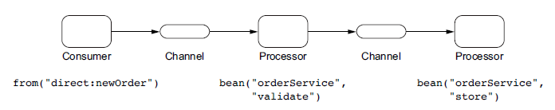
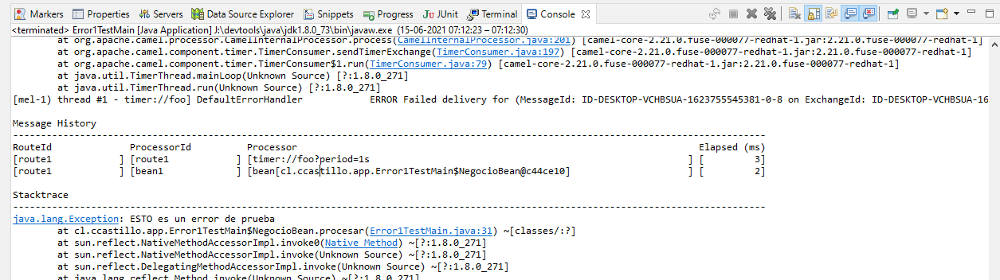
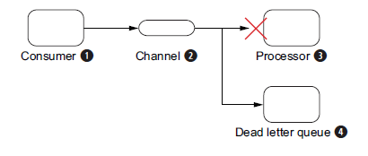
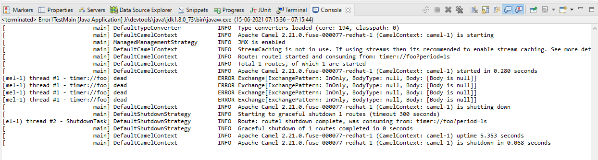
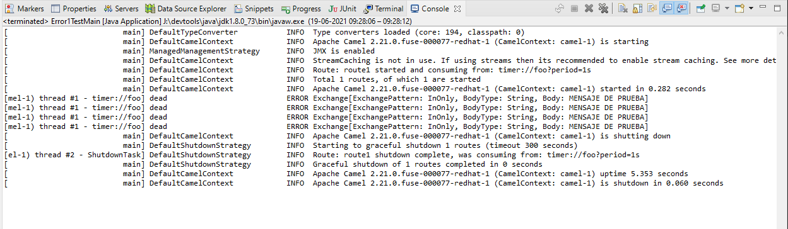

# Error handling

## Using error handlers in Camel

In the last section, you learned that Camel regards all exceptions as recoverable and stores
them on the exchange by using the **setException(Throwable cause)** method. This means error handlers in Camel will react only to exceptions set on the exchange. The rule of thumb is that error handlers in Camel trigger only when  **exchange.getException() != null.**

Error Handler | Description
---|---|---
DefaultErrorHandler| This is the default error handler that’s automatically enabled, in case no other has been configured.
DeadLetterChannel |This error handler implements the Dead Letter Channel EIP.
TransactionErrorHandler |This is a transaction-aware error handler extending the default error handler. Transactions are covered in the chapter 12 and are only briefly touched on in this chapter.
NoErrorHandler |This handler is used to disable error handling altogether.
LoggingErrorHandler |This error handler just logs the exception. This error handler is deprecated,in favor of using the DeadLetterChannel error handler, using a log endpoint as the destination.

### Using the default error handler

Camel is preconfigured to use **DefaultErrorHandler**, which covers most use-cases. To understand it, consider the following route:
```java
from("direct:newOrder")
.bean(orderService, "validate")
.bean(orderService, "store");
```



The default error handler is configured with these settings:
- No redelivery occurs.
- Exceptions are propagated back to the caller.
- The stack trace of the exception is printed to the log.
- The routing history of the exchange is printed to the log.

```java
public class Error1TestMain {
	public static void main(String[] args) throws Exception {
		CamelContext camelContext = new DefaultCamelContext();
		camelContext.addRoutes(new RouteBuilder() {
			@Override
			public void configure() throws Exception {
				from("timer://foo?period=1s")
				.bean(new Error1TestMain().new NegocioBean())
				.log("HOLA MUNDO")
				.to("mock:out");
			}
		});
		camelContext.start();
		TimeUnit.SECONDS.sleep(5);
		camelContext.stop();
	}
	
	public class NegocioBean	{
		public void procesar(Exchange exchange) throws Exception	{
			throw new Exception("ESTO es un error de prueba");
		}
	}
}
```


#### The dead letter channel error handler

**DeadLetterChannel** is an error handler that implements the principles of the Dead Letter Channel EIP. This pattern states that if a message can’t be processed or delivered,
it should be moved to a dead letter queue.



```java
public void configure() throws Exception {
    errorHandler(deadLetterChannel("log:dead?level=ERROR"));

    from("direct:newOrder")
    .bean(orderService, "validate")
    .bean(orderService, "store");
}
```
```xml
<camelContext errorHandlerRef="myErrorHandler">
    <errorHandler id="myErrorHandler" type="DeadLetterChannel" deadLetterUri="log:dead?level=ERROR"/>

    <route>
        <from uri="direct:newOrder"/>
        <bean ref="orderService" method="validate"/>
        <bean ref="orderService" method="store"/>
    </route>
</camelContext>
```
* example
```java
public class Error1TestMain {
	public static void main(String[] args) throws Exception {
		CamelContext camelContext = new DefaultCamelContext();
		camelContext.addRoutes(new RouteBuilder() {
			@Override
			public void configure() throws Exception {
				errorHandler(deadLetterChannel("log:dead?level=ERROR"));
				
				from("timer://foo?period=1s")
				.bean(new Error1TestMain().new NegocioBean())
				.log("HOLA MUNDO")
				.to("mock:out");
			}
		});
		camelContext.start();
		TimeUnit.SECONDS.sleep(5);
		camelContext.stop();
	}
	
	public class NegocioBean	{
		public void procesar(Exchange exchange) throws Exception	{
			throw new Exception("ESTO es un error de prueba");
		}
	}
}
```


**Handling exceptions by default**

```java
Exception e = exchange.getProperty(Exchange.EXCEPTION_CAUGHT, Exception.class);
```
**Using the original message with the dead letter channel**

```java
errorHandler(deadLetterChannel("jms:queue:dead")).useOriginalMessage());

from("jms:queue:inbox")
.bean(orderService, "decrypt")
.bean(orderService, "validate")
.bean(orderService, "enrich")
.to("jms:queue:order");
```

**Enriching message with cause of error**

```java
public class FailureProcessor implements Processor {
    public void process(Exchange exchange) throws Exception {
        Exception e = exchange.getProperty(Exchange.EXCEPTION_CAUGHT,Exception.class);
        String failure = "The message failed because " + e.getMessage();
        exchange.getIn().setHeader("FailureMessage", failure);
    }
}
...
...
errorHandler(deadLetterChannel("jms:queue:dead")
.useOriginalMessage().onPrepareFailure(new FailureProcessor());
```
other case:
```java
public class FailureBean {
    public void enrich(@Headers Map headers, Exception cause){
        String failure = "The message failed because " + e.getMessage();
        headers.put("FailureMessage", failure);
    }
}
...
...
errorHandler(deadLetterChannel("direct:dead").useOriginalMessage();
...
...
from("direct:dead")
.bean(new FailureBean())
.to("mock:dead");

```
#### Caso Ejemplo

```java
public class Error1TestMain {
	public static void main(String[] args) throws Exception {
		CamelContext camelContext = new DefaultCamelContext();
		camelContext.addRoutes(new RouteBuilder() {
			@Override
			public void configure() throws Exception {
				errorHandler(deadLetterChannel("log:dead?level=ERROR"));
				
				from("timer://foo?period=1s")
				.setBody().simple("MENSAJE DE PRUEBA")
				.bean(new Error1TestMain().new NegocioBean())
				.log("HOLA MUNDO")
				.to("mock:out");
			}
		});
		camelContext.start();
		TimeUnit.SECONDS.sleep(5);
		camelContext.stop();
	}
	
	public class NegocioBean	{
		public void procesar(Exchange exchange) throws Exception	{
			throw new Exception("ESTO es un error de prueba");
		}
	}
```




