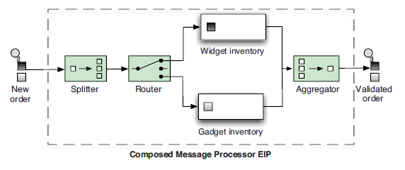

# Enterprise integration patterns

Pattern | Summary
---|---|----
Aggregator | Used to combine results of individual but related messages into a single outgoing message.You can view this as the reverse of the Splitter pattern.
Splitter | Used to split a message into pieces that are routed separately.
Routing Slip | Used to route a message in a series of steps; the sequence of steps isn’t known at design time and may vary for each message. This pattern is covered in section 5.4.
Dynamic Router | Used to route messages with a dynamic router dictating where the message goes.
Load Balancer | Used to balance the load to a given endpoint by using a variety of balancing policies.

## The Aggregator and Splitter EIPs



## Aggregator EIP


**Using AggregationStrategy**

```java
public interface AggregationStrategy {
    Exchange aggregate(Exchange oldExchange, Exchange newExchange);
}
```
*example*
```java
public class MyAggregationStrategy implements AggregationStrategy {
    public Exchange aggregate(Exchange oldExchange, Exchange newExchange) {
        if (oldExchange == null) {
            return newExchange;
        }
        String oldBody = oldExchange.getIn().getBody(String.class);
        String newBody = newExchange.getIn().getBody(String.class);
        String body = oldBody + newBody;
        oldExchange.getIn().setBody(body);
        return oldExchange;
    }
}
```
**Completion conditions for the Aggregator**

Condition |Description
---|---|---
completionSize |Defines a completion condition based on the number of messages aggregated together. You can either use a fixed value (int) or use an Expression to dynamically decide a size at runtime.
completionTimeout |Defines a completion condition based on an inactivity time-out. This condition triggers if a correlation group has been inactive longer than the specified period. Time-outs are scheduled for each correlation group, so the time-out is individual to each group. You can either use a fixed value (long) or an Expression to dynamically decide a time-out at runtime. The period is defined in milliseconds. You can’t use this condition together with the completionInterval.
completionInterval |Defines a completion condition based on a scheduled interval. This condition triggers periodically. There’s a single scheduled time-out for all correlation groups, which causes all groups to complete at the same time. The period (long) is defined in milliseconds. You can’t use this condition together with the completionTimeout.
completionPredicate |Defines a completion condition based on whether the Predicate matched. See also the eagerCheckCompletion option in table 5.5. This condition is enabled automatically if aggregationStrategy implements either Predicate or PreCompletionAwareAggregationStrategy. In the case of PreCompletionAwareAggregationStrategy, this gives you the ability to complete the aggregation group on receipt of a new Exchange and start a new group with the new Exchange.
completionFromBatchConsumer |Defines a completion condition that’s applicable only when the arriving Exchanges are coming from a BatchConsumer (http://camel.apache.org/batch-consumer.html). Numerous components support this condition, such as Atom, File, FTP, HBase, Mail, MyBatis, JClouds, SNMP, SQL, SQS, S3, and JPA. 
forceCompletionOnStop |Defines a completion condition that will complete all correlation groups on shutdown of CamelContext.
aggregateController |By using AggregateController, you can control group completion externally via Java calls into the controller or via JMX.

```java
public void configure() throws Exception {
    from("direct:start")
    .log("Sending ${body}")
    .aggregate(xpath("/order/@customer"), new MyAggregationStrategy())
    .completionSize(2).completionTimeout(5000)
    .log("Sending out ${body}")
    .to("mock:result");
}
```
```xml
<bean id="myAggregationStrategy" class="camelinaction.MyAggregationStrategy"/>
<camelContext xmlns="http://camel.apache.org/schema/spring"> 
    <route>
        <from uri="direct:start"/>
        <log message="Sending ${body}"/>
        <aggregate strategyRef="myAggregationStrategy" completionSize="2" completionTimeout="5000">
            <correlationExpression>
                <xpath>/order/@customer</xpath>
            </correlationExpression>
            <log message="Sending out ${body}"/>
            <to uri="mock:result"/>
        </aggregate>
    </route>
</camelContext>
```

**Caso Ejemplo**

*Especialidad.java*
```java
public enum Especialidad{
	CARDIOLOGIA,
	ENDOCRINOLOGIA,
	OFTALMOLOGIA
}
```
*OrdenAtencion.java*
```java
@AllArgsConstructor
@Getter
@Setter
@ToString
public class OrdenAtencion{
	String uuid;
	String nombrePaciente;
	Especialidad especialidad;
}
```

*OrdenAtencionStrategy.java*
```java
public class OrdenAtencionStrategy implements AggregationStrategy	{
	@SuppressWarnings("unchecked")
	@Override
	public Exchange aggregate(Exchange oldExchange, Exchange newExchange) {
		if( oldExchange == null) {
			List<String> listadoPaciente = new ArrayList<String>();
			oldExchange = new DefaultExchange(newExchange.getContext());

			oldExchange.getIn().setBody(listadoPaciente);
		}
		OrdenAtencion ordenAtencion = newExchange.getIn().getBody(OrdenAtencion.class);
		oldExchange.getIn().setHeader("especialidad", ordenAtencion.getEspecialidad().name() );		
		oldExchange.getIn().getBody(List.class).add( ordenAtencion );
		return oldExchange;
	}
}
```
*Main.java*
```java
	public static void main(String[] args) throws Exception {
		CamelContext camelContext = new DefaultCamelContext();
		camelContext.addRoutes(new RouteBuilder() {
			@Override
			public void configure() throws Exception {
				from("direct:start")
				.log("${body}")
				.aggregate( body().method("getEspecialidad") , new OrdenAtencionStrategy()).completionSize(3).completionTimeout(50)
				.log("${header['especialidad']} -> ${body.size}")
				.to("mock:out");
			}
		});
		camelContext.start();

		Callable<OrdenAtencion> callableTask = () -> {
		    String uuid = UUID.randomUUID().toString();
		    String nombrePaciente = String.format("Paciente %s", uuid);
		    Especialidad especialidad = Especialidad.values()[new Random().nextInt(Especialidad.values().length)];
		    OrdenAtencion ordenAtencion = new OrdenAtencion(uuid.substring(0,8), nombrePaciente , especialidad);
		    return ordenAtencion;
		};
		
		List<Callable<OrdenAtencion>> callableTasks = new ArrayList<>();
		int totalPaciente = new Random().nextInt(100 + 1);
		System.out.println("totalPaciente="+totalPaciente);
		for(int i = 0 ; i < totalPaciente  ; i++) {
			callableTasks.add(callableTask);
		}
		ExecutorService executorService = Executors.newFixedThreadPool(10);
		List<Future<OrdenAtencion>> futures = executorService.invokeAll(callableTasks);
		ProducerTemplate producerTemplate = new DefaultProducerTemplate(camelContext);
		producerTemplate.start();
		futures.forEach( future ->{
			try {
				OrdenAtencion ordenAtencion = future.get();
				producerTemplate.sendBodyAndHeader("direct:start", ordenAtencion , "Especialidad" , ordenAtencion.getEspecialidad());
			} catch (CamelExecutionException | InterruptedException | ExecutionException e) {
				e.printStackTrace();
			}
		});
		TimeUnit.SECONDS.sleep(5);
		executorService.shutdown();
		camelContext.stop();
	}
```
---
## The Splitter EIP

Espera una lista para iterar

*TipoNota.java*
```java
public enum TipoNota {
	PRIVADA,
	PUBLICA,
	PERSONAL,
	NACIONAL,
	INTERNACIONAL,
	DEPORTE
}
```
*Nota.java*
```java
@Data
@AllArgsConstructor
public class Nota {
	public TipoNota tipo;
	public String titulo;
	public String cuerpo;
	public String nombreResponsable;
}
```
*NotaService.java*
```java
public class NotaService {
	public List<Nota> getNotas(TipoNota tipoNota){
		List<Nota> notas = new ArrayList<Nota>();
		for(int i = 0 ; i < 100 ; i++) {
			notas.add(getNota());
		}
		notas.stream().filter( nota -> nota.getTipo().equals( tipoNota ));
		return notas;
	}
	private Nota getNota() {
		TipoNota tipo = new Random().nextInt(100 + 1) % 5 == 0 ?
				TipoNota.PUBLICA : new Random().nextInt(100 + 1) % 5 == 0 ?
						TipoNota.PRIVADA : new Random().nextInt(100 + 1) % 5 == 0 ? 
								TipoNota.PERSONAL : new Random().nextInt(100 + 1) % 5 == 0 ? 
										TipoNota.NACIONAL : new Random().nextInt(100 + 1) % 5 == 0 ?
												TipoNota.INTERNACIONAL : TipoNota.DEPORTE;
		String titulo = "titulo ".concat(UUID.randomUUID().toString());
		String cuerpo = " cuerpo";
		String nombreResponsable = new Random().nextInt(5) % 5 == 0 ? "Cesar" : "Yamilet";
		Nota nota = new Nota(tipo, titulo, cuerpo, nombreResponsable);
		return nota;
	}
}
```
*MAin.java*
```java
	public static void main(String[] args) throws Exception {
		CamelContext camelContext = new DefaultCamelContext();
		camelContext.addRoutes(new RouteBuilder() {
			@Override
			public void configure() throws Exception {
				
				from("direct:start")
				.log("tipoNota = ${body}")
				.split().method(NotaService.class, "getNotas")
				.to("direct:nota");
				
				from("direct:nota")
				.log(" nota -> ${body}")
				.to("mock:out");
			}
		});
		camelContext.start();
		ProducerTemplate producerTemplate = new DefaultProducerTemplate(camelContext);
		producerTemplate.start();
		for(int i = 0; i <  TipoNota.values().length ;i++) {
			producerTemplate.sendBody("direct:start", TipoNota.values()[i]);
		}
		TimeUnit.SECONDS.sleep(10);
		camelContext.stop();
	}
```

## Wire Tap

* Using Concurrency

```java
	public static void main(String[] args) throws Exception {
		CamelContext camelContext = new DefaultCamelContext();
		camelContext.addRoutes(new RouteBuilder() {
			@Override
			public void configure() throws Exception {
				ExecutorService lowPool = new ThreadPoolBuilder(camelContext).poolSize(1).maxPoolSize(5).build("LowPool");
				from("direct:start")
				.log("Incoming message ${body}")
				.wireTap("direct:tap", lowPool)
				.to("mock:result");
				
				from("direct:tap")
				.log("Tapped message ${body}")
				.to("mock:tap");
			}
		});
		camelContext.start();
		ProducerTemplate producerTemplate = new DefaultProducerTemplate(camelContext);
		producerTemplate.start();
		for(String cad : Arrays.asList("A","B","C","D","E","A1","B1","C1","D1","E1")) {
			producerTemplate.sendBody("direct:start", cad);	
		}
		TimeUnit.SECONDS.sleep(5);
		camelContext.stop();
	}
```

### example con jetty

*pom.xml*
```xml
<?xml version="1.0" encoding="UTF-8"?>
<project xmlns="http://maven.apache.org/POM/4.0.0"
	xmlns:xsi="http://www.w3.org/2001/XMLSchema-instance"
	xsi:schemaLocation="http://maven.apache.org/POM/4.0.0 https://maven.apache.org/xsd/maven-4.0.0.xsd">
	<modelVersion>4.0.0</modelVersion>
	<parent>
		<groupId>org.springframework.boot</groupId>
		<artifactId>spring-boot-starter-parent</artifactId>
		<version>2.4.7</version>
		<relativePath /> <!-- lookup parent from repository -->
	</parent>
	<groupId>cl.ccastillo.app</groupId>
	<artifactId>wiretap</artifactId>
	<version>0.0.1-SNAPSHOT</version>
	<name>wiretap</name>
	<description>Demo project for Spring Boot</description>
	<properties>
		<java.version>1.8</java.version>
	</properties>
	<dependencies>
		<dependency>
			<groupId>org.springframework.boot</groupId>
			<artifactId>spring-boot-starter-web</artifactId>
		</dependency>
		<dependency>
			<groupId>org.apache.camel</groupId>
			<artifactId>camel-jetty</artifactId>
			<version>3.10.0</version>
		</dependency>
		<dependency>
			<groupId>org.apache.camel.springboot</groupId>
			<artifactId>camel-spring-boot-starter</artifactId>
			<version>3.10.0</version>
		</dependency>
		<dependency>
			<groupId>org.springframework.boot</groupId>
			<artifactId>spring-boot-starter-test</artifactId>
			<scope>test</scope>
		</dependency>
	</dependencies>
	<build>
		<plugins>
			<plugin>
				<groupId>org.springframework.boot</groupId>
				<artifactId>spring-boot-maven-plugin</artifactId>
			</plugin>
		</plugins>
	</build>

</project>
```
*MisServicios.java*
```java
@Component
public class MisServicios extends RouteBuilder {

	@Override
	public void configure() throws Exception {
		from("jetty:http://localhost:8181/early").routeId("input")
		.wireTap("direct:incoming")
		.transform().constant("OK");
		
		from("direct:incoming").routeId("process")
		.convertBodyTo(String.class)
		.log("Incoming ${body}")
		.delay(3000)
		.log("Processing done for ${body}")
		.to("mock:result");
	}
}
```
*pruebe el comando*
```dos
curl http://localhost:8181/early
```

## Using a content-based router

```java
from("jms:incomingOrders")
.choice()
.when(predicate)
.to("jms:xmlOrders")
.when(predicate)
.to("jms:csvOrders");

public interface Predicate {
    boolean matches(Exchange exchange);
}
```

#### Example

```java
	public static void main(String[] args) throws Exception {
		CamelContext camelContext = new DefaultCamelContext();
		camelContext.addRoutes(new RouteBuilder() {
			@Override
			public void configure() throws Exception {
				from("file:src/data?noop=true")
				.to("direct:ficheros");
				
				from("direct:ficheros")
				.choice()
					.when(header("CamelFileName").endsWith(".xml"))
						.to("direct:toXml")
					.when(header("CamelFileName").endsWith(".csv"))
						.to("direct:toCsv");
				
				from("direct:toXml")
				.log("Received XML order: ${header.CamelFileName}")
				.to("mock:xml");
				
				from("direct:toCsv")
				.log("Received CSV order: ${header.CamelFileName}")
				.to("mock:csv");
			}
		});
		camelContext.start();

		TimeUnit.SECONDS.sleep(5);
		camelContext.stop();
	}
```

## Using recipient lists


```java
from("jms:queue:a")
    .recipientList("direct:a,direct:b,direct:d");
```

```xml
<camelContext xmlns="http://camel.apache.org/schema/spring">
    <route>
        <from uri="jms:queue:a"/>
        <recipientList>
            <constant>direct:b,direct:c,direct:d</constant>
        </recipientList>
    </route>
</camelContext>
```
#### EXAMPLE

*EmployeeRouter.java*
```java
public class EmployeeRouter {
    public String[] routeEmployee(Employee emp) {
        if (emp.isResigning()) {
            return new String[]{"direct:account", "direct:hr"};
        }
        if (emp.isNew()) {
            return new String[]{"direct:manager", "direct:account", "direct:hr"};
        }
        if (emp.isOnLeave()) {
            return new String[]{"direct:manager", "direct:hr"};
        }
        if (emp.isPromoted()) {
            return new String[]{"direct:hr", "direct:account"};
        }
         
        return new String[]{"direct:hr"};
    }
}
```
*Main.java*
```java
  public static final void main(String[] args) throws Exception {
        JndiContext jndiContext = new JndiContext();
        jndiContext.bind("empRouter", new EmployeeRouter());
        CamelContext camelContext = new DefaultCamelContext(jndiContext);
        try {
            camelContext.addRoutes(new RouteBuilder() {
                public void configure() {
                    from("direct:start")
                    .recipientList(method("empRouter", "routeEmployee"));
                     
                    from("direct:account")
                    .log("Account department notified '${body}'");
                     
                    from("direct:hr")
                    .log("HR department notified '${body}'");
                     
                    from("direct:manager")
                    .log("Manager notified '${body}'");
                }
            });
            ProducerTemplate template = camelContext.createProducerTemplate();
            camelContext.start();
            System.out.println("************************");
            Employee sam = new Employee("Sam");
            sam.setNew(true);
            sam.setMessage("Joined");
             
            template.sendBody("direct:start", sam);
             
            System.out.println("************************");
             
            Employee john = new Employee("John");
            john.setOnLeave(true);
            john.setMessage("On Leave");
            template.sendBody("direct:start", john);
             
            System.out.println("************************");
             
            Employee roy = new Employee("Roy");
            roy.setPromoted(true);
            roy.setMessage("Promoted");
            template.sendBody("direct:start", roy);
             
            System.out.println("************************");
             
            Employee ram = new Employee("Ram");
            ram.setResigning(true);
            ram.setMessage("Resigning");
            template.sendBody("direct:start", ram);
             
            System.out.println("************************");
        } finally {
            camelContext.stop();
        }
    }
```
